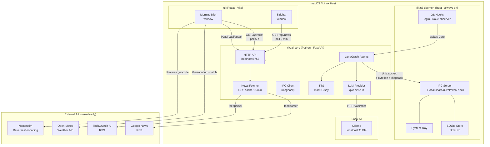
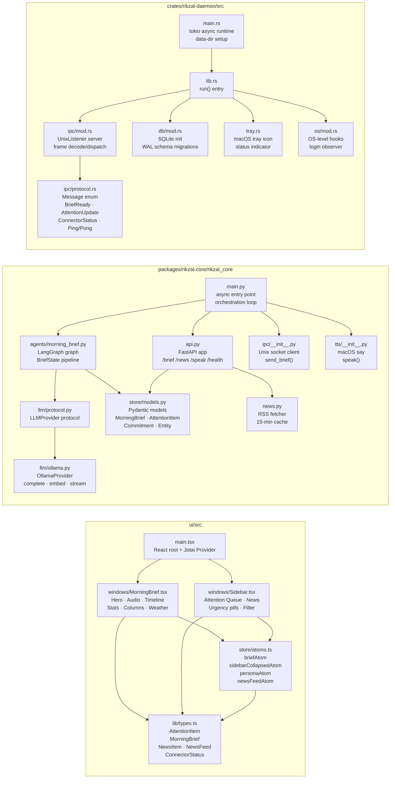
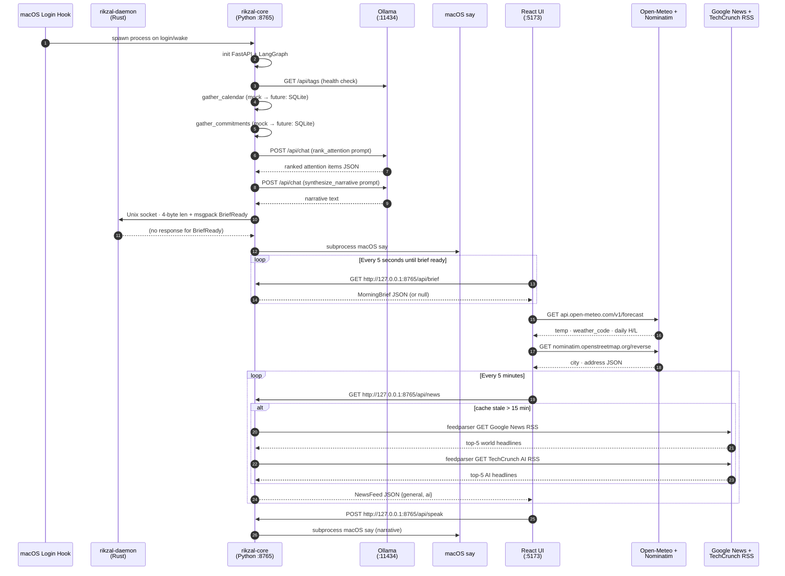
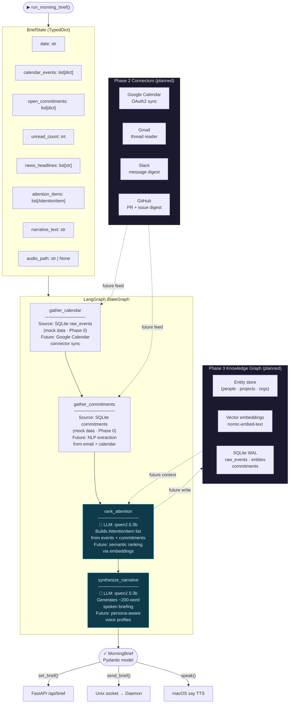

# RikZal Architecture

---

## 1. Services Architecture

High-level view of the three long-running processes and their runtime boundaries.

---

## 2. Component-Based Architecture

Internal composition of each service: modules, files, and their responsibilities.

---

## 3. Traffic Routing

Request and data flows across all boundaries, annotated with protocols and ports.

---

## 4. Agentic Architecture

The LangGraph pipeline inside `rikzal-core` — state graph, node responsibilities, LLM touch-points, and planned connector expansions.

